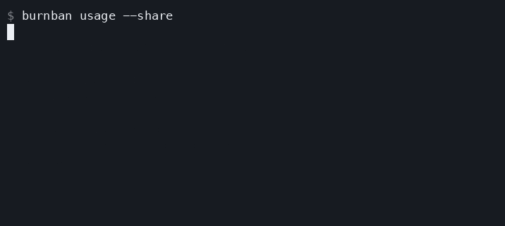

# burnban

[](https://github.com/burnban/burnban/actions/workflows/ci.yml)

**A local meter that prices subscription-agent usage and caps API-key spend before the next dollar leaves.**

One maintainer machine recorded **$4,173.49 of API-equivalent usage in 30 days** on a $200/month plan, or **20.9× the plan price at API rates**. Burnban reads the local usage logs your agents already keep and gives you the same number without an account, proxy, or upload.



Install on macOS or Linux:

```sh
curl -fsSL https://burnban.sh/install | sh
```

The interactive installer runs guided setup, starts the local meter, opens the
interface you choose, and installs a per-user login-start entry so the dashboard
remains available after a restart. Use `--no-autostart` to skip login start or
`--no-launch` to install without starting it immediately:

```sh
curl -fsSL https://burnban.sh/install | sh -s -- --no-autostart --no-launch
```

Then get your number:

```sh
burnban usage --share
```

The card includes the time window, the multiple of the plan price, install command, and `burnban.dev`, ready to screenshot. Use `--plan-cost 100` for your actual monthly price, `--since 7d` for another window, or `--share --json` for the same fields as structured data.

Windows PowerShell:

```powershell
irm https://raw.githubusercontent.com/burnban/burnban/main/install.ps1 | iex
```

When saving the PowerShell installer for a customized install, pass
`-NoAutostart` and/or `-NoLaunch` for the equivalent Windows opt-outs.

Release installers verify the archive against published SHA-256 checksums. For a reviewable install, download the script first, inspect it, then run it. Releases also publish SPDX SBOMs, third-party notices, and GitHub provenance attestations.

## Price the plans you already use

Claude Code, Codex, Gemini CLI, GitHub Copilot CLI, Cursor, OpenCode, Hermes Agent, OpenClaw, and Goose retain local usage metadata. Burnban reads those stores in place, read-only, and prices the input, output, cache-read, and cache-write dimensions each source actually exposes with its dated API table:

```sh
burnban usage                 # auto-detect all nine sources; last 30 days
burnban usage --since 7d      # another window
burnban usage --daily --json  # daily detail or machine-readable output
```

The $4,173.49 result is a real machine's last 30 days, not a provider invoice. The calculation is cache-aware, prices Anthropic's 1-hour cache-write tier at its real 2× rate, and deduplicates repeated message IDs instead of inflating the result.

Local readers implement a versioned, metadata-only [source adapter contract](SOURCE_ADAPTERS.md). Each adapter is read-only, offline, resource-bounded, fixture-tested, and declares its privacy behavior. The registry remains compile-time; Burnban never downloads or executes plugins.

Gemini CLI, GitHub Copilot CLI, Cursor, and OpenCode histories do not prove whether the selected traffic was subscription/included usage or separately billed model credentials. Burnban therefore keeps them in the API-equivalent comparison by default; use `--metered` only when you can classify the selected window. Copilot, Cursor, and OpenCode discovery can be overridden with `--copilot-dir`, `--cursor-db`, and `--opencode-db`. Cursor's undocumented composer store exposes per-turn input/output totals but not cache or reasoning decomposition; Burnban requires exact ordered header/message associations, marks its events/report `partial`, and prices all stored input at the full-input rate.

## Proxy quickstart

The same binary can guard API-key traffic in real time. Start with deterministic demo data if you have no proxy traffic yet:

```sh
burnban demo    # isolated dashboard on http://localhost:4242
```

Demo mode never scans real agent logs or forwards model traffic. For the real meter:


```sh
# Terminal 1
burnban serve
```

In Terminal 2:

```sh
# Keys stay in your environment; Burnban forwards but never persists them.
export ANTHROPIC_BASE_URL=http://localhost:4141/anthropic
export OPENAI_BASE_URL=http://localhost:4141/openai/v1

burnban top
open http://localhost:4141
```

Or launch **Burnban** from the desktop/application menu (`burnban desktop`). The installer adds the launcher and starts the same local meter at login without Electron, an account, or a cloud service. The dashboard keeps subscription-log usage separate from proxy-billed traffic, so a `$0` proxy ledger never hides the work your plans performed.

Set hard local guardrails:

```sh
burnban cap --daily 10 --weekly 40 --monthly 120
burnban cap --agent openclaw --daily 3
burnban cap --warn 80
burnban fuse --hourly 20 --burst 5m:4 --fanout 1m:120 --cooldown 15m
burnban fuse --baseline 3x --baseline-window 1h --baseline-days 14 --baseline-minimum .25
burnban ban
burnban lift --today
```

The deterministic fuse stops loops and fan-out before they can consume a much
larger daily allowance. `--hourly 20` limits every rolling hour; `--burst 5m:4`
limits every rolling five minutes; and `--fanout 1m:120` independently limits
settled plus in-flight provider requests even when pricing is missing or the
model is free. `--baseline 3x` compares the current fixed UTC slot with the
median spend in that same slot over prior days, with an explicit minimum floor
for new or idle installations. Crossing a threshold—using recorded spend plus
conservative in-flight request bounds where dollars are involved—starts a
restart-safe 15-minute cooldown. Run `burnban fuse` for the live reason,
historical baseline, projected time to a dollar limit, and remaining request
headroom. Use `burnban fuse --reset` to recover early or `burnban fuse --off`
to remove every fuse rule.

Burnban serializes admission and reserves conservative request cost against in-flight work. Known models with output-token limits are rejected before forwarding when they cannot fit. Unknown-price traffic and accounting gaps fail closed under an active dollar guardrail; a single unbounded call can still overshoot because its final cost is unknowable in advance. These are strong local guardrails, not a provider-side billing limit.

Reprice traffic you already ran:

```sh
burnban whatif --since 7d
```

Which door is yours?

- **Flat-rate or agent-managed plan** — run `burnban usage` with no proxy to price supported local logs.
- **Per-token keys** — run `burnban serve` to meter and cap spend in the request path.

## Trust, by construction

- **Local meter and ledger** — usage accounting and policy state stay on your machine in SQLite.
- **Keys forwarded, never stored** — provider credentials go only to the upstream you configure and are never persisted.
- **No Burnban telemetry path** — no account, license check, passive analytics, or code path to a Burnban-operated service exists in the MIT binary. Metadata-only OTLP export exists only when you point it at your own collector.
- **Self-contained interface** — the dashboard, fonts, and assets are embedded or self-hosted; no CDN or third-party script is loaded.

What it sees: request metadata and provider usage frames needed to meter live traffic, plus token/model/session metadata in supported local agent logs. It does not persist request or response bodies. Extra outbound traffic exists only for an optional webhook or metadata-only OTLP collector you explicitly configure; model traffic still goes to the provider or custom upstream you selected. See [data and privacy](DATA_AND_PRIVACY.md) for the exact contract.

## What you get

- **Local + live dashboard** at `http://localhost:4141` — auto-detected subscription/agent logs with dollar and token breakdowns, plus live proxy burn, calendar/fuse guardrail bars, per-model/per-agent tables, and waste receipts. One embedded HTML file served from the binary: no CDNs, no build step, nothing loads from the internet.
- **`burnban top`** — the same live view in your terminal: per-model and per-agent spend, cache hit rate, last-hour spend, and every budget window. Redirected output is plain text; `--once` prints one snapshot.
- **`burnban report`** — spend for any window, plus heuristic receipts for potential duplicate calls and low cache reuse. Findings are deliberately labeled as signals, not proof of waste.
- **`burnban whatif`** — reprice a window's actual traffic onto any model in the table, cache economics included. "Your week on haiku: $9.22 (−82%)" — from your own ledger, not a pricing page.
- **`burnban reconcile`** — import bounded, immutable provider invoice evidence and compare billed amounts, credits, batch adjustments, unmatched traffic, variance, confidence, and last reconciliation time without rewriting the observed ledger. See [RECONCILIATION.md](RECONCILIATION.md).
- **OpenTelemetry + warehouse export** — opt-in, content-free OTLP/HTTP traces and GenAI metrics with bounded asynchronous delivery, plus atomic date/hour-partitioned NDJSON batches, SHA-256 manifests, a typed schema, and dbt staging contract. See [TELEMETRY.md](TELEMETRY.md).
- **Local policy engine v2** — typed/versioned provider, model, route, tier, and geo allow/deny rules; rolling/fixed request and token windows; concurrency and maximum-call-cost bounds; observe/warn/enforce rollout; durable explanations, historical simulation, six workload templates, and metadata-only enforcement/identity/bypass coverage health. See [POLICY_ENGINE.md](POLICY_ENGINE.md).
- **Explicit budget-aware downshift** — after Policy v2, exact operator-allowlisted equivalent model families can warn and then move compatible bounded requests to a cheaper provider or local Ollama/vLLM route. Dialect, tool schema, modality, context, structured-output, identity, and actual target-price gates fail closed; historical dry-run or an audited force reason is required before activation. See [DOWNSHIFT_ROUTING.md](DOWNSHIFT_ROUTING.md).
- **`burnban usage`** — no proxy needed: read the local usage stores Claude Code, Codex, Gemini CLI, GitHub Copilot CLI, Cursor, OpenCode, Hermes Agent, OpenClaw, and Goose already keep, with per-model usage confidence and API-equivalent prices.
- **Bounded local scans** — the dashboard applies a 512 MiB per-source preflight envelope and 10-second scan deadline by default, labeling oversized, growing, or otherwise incomplete sources `partial`; operators with larger local histories can raise those bounds explicitly with `burnban serve --local-usage-max-scan-mb 2048 --local-usage-scan-timeout 30s`.
- **Budget guardrails** — daily, weekly, and monthly caps plus rolling hourly/burst spend, same-slot historical-baseline, and request fan-out fuses enforced during admission with in-flight reservations, per-agent daily caps, automatic fuse cooldowns, retried webhooks, and a manual **burn ban** kill switch.
- **Honest confidence states** — usage and pricing are tracked independently as exact, estimated, partial, missing, priced, unknown, or unmetered. Unknown-price traffic is never guessed, and active dollar guardrails fail safe around accounting gaps.
- **Operations built in** — `burnban doctor`, `status`, `stop`, `pricing`, and explicit `prune` commands; `/health` reports persistence and in-flight reservation state.

## How it works

```
agents (Claude Code, Codex, OpenClaw, Hermes, your app)
   │  one env var change
   ▼
burnban serve  ──►  anthropic / openai / gemini / xai / any --upstream
   │
   ├─ relays provider requests/responses and streams SSE as it arrives
   ├─ reads usage frames and request-side bounds, prices them (cache-aware)
   ├─ reserves in-flight budget; trips rolling velocity fuses before runaway spend
   ├─ fails closed on persistence, pricing, and accounting gaps
   ├─ SQLite at ~/.burnban/burnban.db — yours, greppable
   └─ refuses to forward when you're over budget
```

Burnban binds to `127.0.0.1` by default and validates loopback `Host`, `Origin`,
and browser fetch metadata to resist DNS rebinding. Ordinary proxy traffic is
byte-semantic pass-through; the only model rewrite is an explicitly activated,
compatibility-gated downshift rule, which changes the model selector and records
the exact choice. Burnban may normalize hop-by-hop transport framing while
relaying responses. API keys are forwarded unchanged to the configured upstream
and never persisted or selected from a vault.

The primary metered surfaces are text-generation endpoints using Anthropic,
OpenAI-compatible, and Gemini usage shapes. Other successful POST endpoints are
forwarded, but if Burnban cannot obtain safe usage they are marked unmetered; an
active dollar guardrail then fails closed rather than pretending the call cost $0.

## Why not the big gateway?

The tools in this space either **watch** or **weigh a ton**. Log reporters ([ccusage](https://github.com/ccusage/ccusage), usage monitors) read what your agents already spent and can't stop the next dollar. Platform gateways enforce budgets, but [LiteLLM needs Postgres for budget state and Redis to enforce accurately across workers](https://docs.litellm.ai/docs/proxy/users), issues clients **its own virtual keys** instead of passing yours through, and [benchmarks its proxy overhead in milliseconds on a four-instance cluster](https://docs.litellm.ai/docs/benchmarks). Cloud gateways cap spend fine — through their cloud.

|  | log reporters (ccusage…) | platform gateways (LiteLLM…) | cloud gateways (Cloudflare…) | **burnban** |
|---|---|---|---|---|
| local preflight spend guard | — | yes | yes | **yes — reservation + 402 + kill switch** |
| runs entirely on your machine | yes | partly; self-hosted service | — | **yes — localhost-only default** |
| your provider keys stay yours | yes; n/a | — virtual keys | — provider keys uploaded | **yes — pass-through, never stored** |
| infra needed | none | Postgres + Redis + config | an account | **one binary, one local SQLite ledger** |
| waste receipts (dupes, cache misses) | — | — | — | yes |
| reprice your traffic (`whatif`) | — | — | — | yes |
| agent self-throttling over MCP | — | — | — | yes |

The honest flip side: LiteLLM speaks 100+ providers and does routing, fallbacks, and org-level key issuance — if you're a platform team standing up a company gateway, use it. Burnban is for the other 99%: you, your laptop, your agents, your bill.

### Measure it, don't trust it

```sh
burnban bench --requests 2000 --concurrency 4
```

stands up an instant loopback upstream and runs the same traffic direct and
through a fully armed proxy — metering, pricing, and a live budget check on
every request. In three runs of 2,000 total requests at concurrency 4:

```
                     p50          p90          p99         mean
direct           77–85µs    117–136µs    261–280µs      88–95µs
burnban        575–583µs    938–986µs    5.1–5.4ms    755–797µs
──────────────────────────────────────────────────────────────
added          494–503µs    801–869µs    4.8–5.2ms    667–702µs
```

Those are the ranges from three pre-release runs on an Apple M2 Pro (macOS
26.5, Go 1.25.12, 2026-07-11). The roughly **0.5ms median includes the
WAL-backed SQLite ledger insert and live cap enforcement**. A separate
100,000-row guard benchmark measured a 36.6ms first cache fill and 38µs warm
admissions with no warm ledger scan. SQLite uses `synchronous=NORMAL`, so this
is a latency measurement, not a claim that the final moments survive an OS
crash. Percentiles are nearest-rank, warts kept; tagged candidates are rerun
under the release checklist. Run it on your own hardware and check.

## Providers

| provider  | point your client at                | env var the SDKs read |
|-----------|-------------------------------------|-----------------------|
| Anthropic | `http://localhost:4141/anthropic`   | `ANTHROPIC_BASE_URL`  |
| OpenAI    | `http://localhost:4141/openai/v1`   | `OPENAI_BASE_URL`     |
| Gemini    | `http://localhost:4141/gemini`      | `GOOGLE_GEMINI_BASE_URL` |
| xAI       | `http://localhost:4141/xai/v1`      | `OPENAI_BASE_URL` (xAI SDKs are OpenAI-compatible) |
| OpenRouter | `http://localhost:4141/openrouter/v1` | client API-base setting |
| Groq      | `http://localhost:4141/groq/v1`     | client API-base setting |
| Mistral   | `http://localhost:4141/mistral/v1`  | client API-base setting |
| DeepSeek  | `http://localhost:4141/deepseek/v1` | client API-base setting |
| Ollama    | `http://localhost:4141/ollama/v1`   | client API-base setting |
| vLLM      | `http://localhost:4141/vllm/v1`     | client API-base setting |

Those popular OpenAI-compatible routes work out of the box. Add any other
endpoint with `--upstream`:

```sh
burnban serve --upstream corp=https://llm.corp.internal/openai
# then point the client at http://localhost:4141/corp/v1/…
```

Endpoint speaks a different dialect? Prefix the url with its usage shape — `--upstream corp=anthropic:https://llm.corp.internal` — and burnban meters it with that provider's parser.

Attribution: Burnban normalizes identifying user agents for Claude Code,
Codex, Hermes, OpenClaw, Aider, Goose, Cline, Roo Code, Continue, Cursor,
Windsurf, and OpenCode. For exact custom tracking, send `x-burnban-agent` /
`x-burnban-session` headers (Claude Code: `ANTHROPIC_CUSTOM_HEADERS`). Explicit
identities are rejected above 128 Unicode characters or 256 UTF-8 bytes rather
than truncated into a different cap identity. Provider/client-derived display
labels are sanitized and bounded with a deterministic hash suffix.

Agent/session labels and unsigned team/user/project headers remain cooperative
attribution. An enrolled Personal or Teams sidecar can instead issue a
two-minute, one-use `X-Burnban-Identity` proof bound to the exact POST route,
query, and body. The OSS proxy verifies the device's Ed25519 signature and
server-authorized principal/service-account/cost-center mapping. Projects are
authenticated only when named exactly in the server grant; the current
wildcard grants keep signed project labels explicitly self-reported. The proxy
strips the proof locally, rejects override attempts, and records field-level
authenticated versus self-reported/unverified confidence. Provider credentials
are unchanged. See
[device-bound signed identity](SIGNED_IDENTITY.md) for issuance, offline
expiry/revocation, and the same-user compromise boundary.

OpenAI streaming note: send `stream_options: {"include_usage": true}` for exact
provider counts. Without it Burnban estimates observed text, tool-call arguments,
reasoning deltas, and request input; truncated/cancelled streams are explicitly
marked partial lower bounds. Burnban does not silently add this option to your
request.

## Plug it into your tools (MCP)

Burnban ships an MCP server, so any MCP client — Claude Code, Claude Desktop,
Cursor — can query local spend in natural language:

```sh
claude mcp add burnban -- burnban mcp
```

Read-only is the secure default. It exposes `spend_summary`, `burn_status`,
`pricing_diagnostics`, and `policy_status`; `burn_status` reports calendar budgets, rolling fuse
runway/cooldowns, and a named agent's daily spent/cap/remaining position.
Everything runs over stdio against the local database—no network and no
provider keys.

Budget mutation tools are intentionally absent unless the human launching the
MCP server grants that authority:

```sh
claude mcp add burnban-admin -- burnban mcp --allow-budget-admin
```

That opt-in adds strict-argument `set_daily_cap` (daily/weekly/monthly),
`burn_ban`, and `lift_burn_ban` tools. Prompt content cannot turn a read-only
MCP process into an administrator, and missing `usd` is rejected rather than
interpreted as “remove the cap.”

An independently gated tool can ask a Burnban Teams human for temporary runway
without granting the agent budget authority:

```sh
export BURNBAN_TEAMS_URL=https://teams.example.com
export BURNBAN_TEAMS_METER_ID=mtr_...
export BURNBAN_TEAMS_METER_TOKEN=bbt_...
claude mcp add burnban-requester -- burnban mcp --allow-budget-requests
```

`request_budget_exception` is fixed to that enrolled meter and creates only a
pending, expiring request with a reason and ticket. It cannot approve, deny,
break glass, or change a local cap. The HTTPS client rejects redirects and
mismatched receipts; the response always states that human authorization is
required. This is the only MCP mode that contacts a control plane.

`burn_status` reports spent/cap/**remaining** per calendar and rolling window,
which turns budgets into something agents can plan around: an agent that can
ask *"how much runway is left?"* can downshift models or stop gracefully instead
of slamming into the 402.

## For IT managers

One binary and one local SQLite ledger. SQLite may create WAL/shared-memory
files while running, and Burnban keeps a private lifecycle-state file beside
the ledger. Burnban adds no unsolicited telemetry destination; model
traffic still goes to the upstream provider or internal endpoint you configure.
Three deployment shapes:

1. **Per developer** (default) — localhost-only, zero config, each dev owns their meter.
2. **Team gateway** — one instance the whole team points at:

   ```sh
   export BURNBAN_TOKEN="$(openssl rand -hex 32)"
   burnban serve --host 0.0.0.0 \
     --tls-cert /etc/burnban/tls.crt --tls-key /etc/burnban/tls.key \
     --public-url https://burnban.example.com
   ```

   Keep that exact value in a secret manager and distribute it only to authorized
   users and clients. Non-loopback binds **fail closed** without a strong token
   and TLS. Clients authenticate with the `x-burnban-token` header (Claude Code:
   `ANTHROPIC_CUSTOM_HEADERS="x-burnban-token: ..."`); it is consumed locally and
   never forwarded to providers. Bearer auth is reserved for Burnban-owned API
   routes because provider routes need `Authorization` for the provider key.
   The public dashboard shell prompts for the token and holds it in tab-scoped
   session storage; URL/query tokens are rejected and legacy `?token=` values
   are removed without being consumed. Spend is attributed per agent and per
   `x-burnban-session`; those attribution headers also stay local. Team clients
   that cannot send a custom Burnban header are not compatible with team mode.
   Host-local Claude/Codex/etc. log scanning is disabled on a team/network
   gateway so the operator account's local usage is not exposed to token users;
   `burnban usage` remains available as a local CLI workflow on that host.
   Agent/session labels are self-asserted by any client holding the shared token:
   they are useful cooperative attribution and cap labels, not authenticated
   user identity. Optional Personal/Teams enrollment adds a separate
   device-bound signed identity envelope; it does not replace this gateway token
   or the provider key. Enforcing team/user policy requires exact signed
   attribution; project enforcement additionally requires an exact project in
   the server grant. Wildcard or omitted projects fail closed, as does a stale
   short-lived trust grant.
3. **Docker** — the image runs as an unprivileged UID with `/data` as its
   writable volume. Bind the host side to loopback and put TLS at your ingress:
   `docker build -t burnban . && docker run -e BURNBAN_TOKEN=... -p 127.0.0.1:4141:4141 -v burnban-data:/data burnban serve --host 0.0.0.0 --allow-insecure-http --public-url https://burnban.example.com`.
   The escape hatch is only for a local container bridge or TLS reverse proxy;
   never expose that plaintext port directly to a network.

And the plumbing your existing stack expects:

- **Prometheus** — scrape `/metrics`: retained-ledger request/spend gauges,
  bounded per-model/per-agent gauges, spend and cap gauges for the
  day/week/month and rolling fuse windows, confidence states, fuse trip state,
  and ban state. Retained-ledger gauges can decrease after an explicit `prune`;
  they are not monotonic counters.
- **Alerts** — `burnban alert --webhook https://hooks.slack.com/...` posts to Slack (or anything webhook-compatible) at 80% of any cap (tune with `cap --warn`), when a cap trips, and for each velocity-fuse incident.
- **Finance export** — `burnban export --since 7d --format csv` dumps the raw ledger, including frozen price source/reference/effective dates/confidence, for cost allocation; `--format json` for pipelines. Spreadsheet formulas and terminal controls in provider-controlled labels are neutralized.
- **Content-free optimization** — `burnban optimize cache` emits metadata-only large-context/cache-reuse receipts, while `burnban optimize allocation` proposes (and never applies) agent, project, authenticated meter, or authenticated team budgets and replays historical blocked-call impact. A narrow immutable external-score API can constrain `whatif` only when the candidate has supplied cohort coverage. See [OPTIMIZATION.md](OPTIMIZATION.md).
- **Budget-aware routing evidence** — `burnban downshift simulate` replays content-free compatibility receipts before activation; selected/requested routes, models, reasons, config digest, and source/target admission costs flow to finance export and optional telemetry. Burnban never stores an upstream URL, credential, prompt, or tool schema for routing. See [DOWNSHIFT_ROUTING.md](DOWNSHIFT_ROUTING.md).
- **OTLP/warehouse export** — `burnban serve --otlp-endpoint https://otel.example.com:4318` opts into metadata-only OTLP/HTTP export to your collector; `burnban telemetry export` creates bounded, checksum-manifested NDJSON object batches. Both omit prompt/response/header content. See [TELEMETRY.md](TELEMETRY.md).
- **Audit trail** — every request row (timestamp, provider route, model, agent/session labels, authenticated or self-reported identity provenance, tokens, usage/pricing confidence, price provenance, cost, status) lives in plain SQLite you can query directly. Imported invoices and reconciliation adjustments are immutable separate tables; request bodies are never stored and duplicate heuristics use a keyed local fingerprint.

## Pricing table

The embedded July 10, 2026 snapshot includes Claude Sonnet 5's time-bounded
introductory price, Fable 5 / Opus 4.8 / Sonnet 4.6 / Haiku 4.5, GPT-5.6
Sol/Terra/Luna, Gemini 3.1 Pro / 3.5 Flash / 3.1 Flash-Lite, Grok 4.5, and
historical generations used by local logs. Per-request long-context tiers and
cache economics are included. The table carries source URLs, effective dates,
verification dates, and expiry diagnostics:

```sh
burnban pricing
burnban pricing --model claude-sonnet-5
burnban doctor
```

Vendors change prices. Override or extend without waiting for a release by
creating `~/.burnban/pricing.json`:

```json
{"models": {"grok-4.5": {"input_per_mtok": 2.0, "output_per_mtok": 6.0, "cache_read_mult": 0.1}}}
```

The same file supports dated customer contract rates scoped by provider,
model, region, and service tier. Every request freezes the winning source,
reference, effective dates, and confidence on its ledger row. Provider final
cost beats contract pricing, contract pricing beats public list price, and an
unsupported or expired price remains visibly unknown. Configuration and
invoice examples are in [RECONCILIATION.md](RECONCILIATION.md).

Overrides are decoded strictly: misspelled fields, trailing JSON, negative or
non-finite values, and zero paid input/output rates are rejected. A truly free
model must say `"free": true` explicitly.

## Operations, data, and uninstall

```sh
burnban status                         # running PID, URL, DB, start time
burnban doctor                         # DB write, price freshness, health, recent routing
burnban stop                           # authenticated local graceful shutdown
burnban prune --older-than 90d --yes   # explicit, irreversible ledger retention
burnban policy templates starter > policy.json
burnban policy simulate --since 7d policy.json
burnban policy apply policy.json
burnban policy coverage --since 7d
burnban downshift simulate --since 30d downshift.json
burnban downshift apply --since 30d downshift.json
burnban telemetry export --since 30d --out ./exports
```

For supervisors, `burnban status --json` emits a stable health document and
returns nonzero when the meter is inactive, unreachable, malformed, or
fail-closed/unhealthy.

Burnban never prunes implicitly. `prune` deletes request rows only; caps and
settings remain, runs in bounded batches, and refuses while the ledger is being
served. Pruning is logical retention and does not necessarily shrink the file;
run SQLite `VACUUM` separately while Burnban is stopped if physical reclamation
is required. Stop the meter before copying the SQLite database for a simple
offline backup. Runtime lifecycle state is stored beside the selected database
with mode `0600` where POSIX permissions apply and contains a random local
control token. On Windows, isolation relies on the containing directory's ACL;
keep any custom database directory private to the service account. Lifecycle
commands use a separate ephemeral HTTP listener bound only to `127.0.0.1`, even
when the public listener uses TLS.

The tokenless localhost default is network-local, not an operating-system user
boundary: another process or user account on the same shared host may be able to
read dashboard/metrics data or send provider requests through the listener. Set
`BURNBAN_TOKEN` even on loopback when the machine is shared or untrusted.

The installer records only files it owns. Normal uninstall stops the default
meter and removes the binary, managed login-start entry, launcher/shortcuts,
and managed PATH block while retaining
`~/.burnban`; purge is a separate explicit action and refuses to run while the
meter is active:

```sh
curl -fsSL https://burnban.sh/install | sh -s -- --uninstall
curl -fsSL https://burnban.sh/install | sh -s -- --uninstall --purge
```

On Windows, save `install.ps1`, inspect it, then run
`./install.ps1 -Uninstall` or `./install.ps1 -Uninstall -Purge`.

See [data and privacy](DATA_AND_PRIVACY.md), [OpenTelemetry and warehouse export](TELEMETRY.md), [device-bound signed identity](SIGNED_IDENTITY.md),
[security reporting](SECURITY.md), [support](SUPPORT.md), [contributing](CONTRIBUTING.md), and
[release verification](RELEASING.md) for the full contracts.

## Free forever vs. paid

Everything in this README — the proxy, dashboard, caps, velocity fuse, compatibility-gated downshift, `usage`, `whatif`, MCP, exports, and the single-box team gateway — is MIT and free, permanently. The binary has no unsolicited telemetry, account, license checks, or code path to a Burnban-operated service. Its only outbound paths are the provider/custom upstream selected by the operator and optional operator-configured webhook or OTLP collector. Any future Burnban-hosted feature ships as a separate opt-in product, never hidden in the meter.

Burnban's separately maintained product ladder is:

- **Personal Sync preview** — Burnban's maintained client and hosted coordination service for one person's machines. It is not yet available for purchase; the separate manual-account MVP is being validated before billing and activation are enabled.
- **[Team](https://burnban.dev#pricing)** — $25/month for 5 users — the centralized control plane and opt-in connector for fleets: org-wide budgets pushed to every meter and still enforced locally, one dashboard across every dev/CI runner/server, per-person/CI/agent attribution, an immutable policy audit log, and chargeback exports.
- **Enterprise development track** — OIDC, SCIM, granular RBAC, and self-hosted deployment tooling are implemented in the separate Teams repository but are not part of the latest published meter release. SAML remains unshipped pending customer IdP metadata, certificate lifecycle, replay/RelayState validation, and live interoperability testing. SLA, priority support, and a guided rollout require a commercial engagement. [Talk to us](https://burnban.dev#pricing).

The MIT meter only recognizes generic local `external_*` policy settings; it contains no sync endpoint, account, license check, vendor URL, or upload client. Meters keep enforcing their last local policy and serving traffic if a sidecar is unreachable. The seam is deliberately vendor-neutral: anyone may build and self-host their own coordinator against the documented [external-policy contract](EXTERNAL_POLICY.md). The paid products provide maintained coordination, not exclusive access to the meter or its extension point.

## Roadmap

- **Cache-aware request-shaping evidence** — report metadata-only large-context and low cache-reuse receipts; prefix stability remains unobserved because Burnban does not store prompt content or fingerprints
- **State of Agent Spend** — opt-in anonymous aggregates, published monthly
- **Burnban Teams** — the paid fleet control plane above; [early access](https://burnban.dev#teams)

## Development

The capabilities documented on this branch describe the current development
tree. The latest published release can lag `main`; verify the selected tag and
its release notes before treating a source-tree feature as installed.

Prerequisite: Go 1.25.12 or newer. From a source checkout:

```sh
go mod verify
make build   # single static binary, no cgo
make test    # offline: fixtures, not API calls — development burns $0
go test -race ./...
```

Configuration is CLI flags first, with `BURNBAN_DB`, `BURNBAN_TOKEN`, and the
documented provider-upstream environment variables supplying defaults where
applicable. Run `burnban <command> --help` for the authoritative flags. Please
read [CONTRIBUTING.md](CONTRIBUTING.md) before submitting a change; never paste
provider keys, raw prompts, private logs, or a real Burnban database into an
issue.

MIT © Oday Brahem
