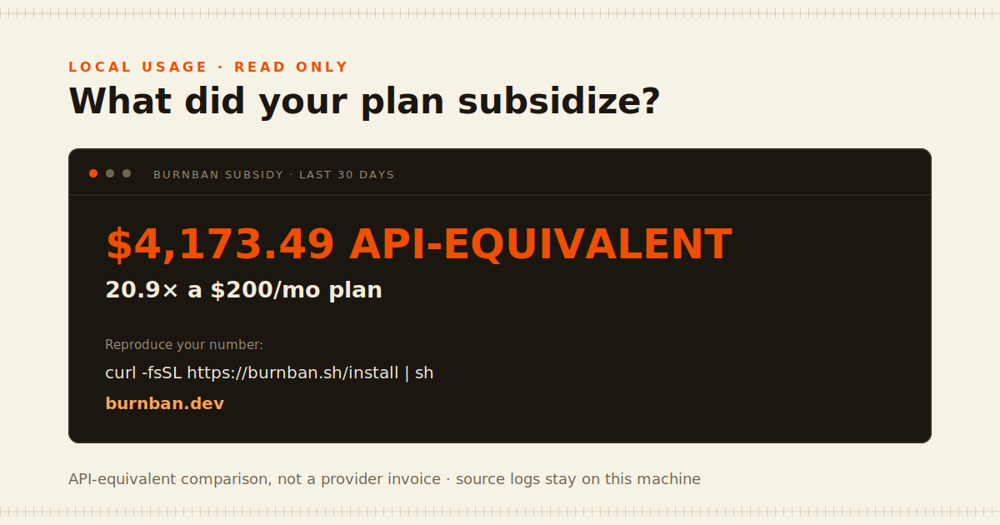

# burnban

[](https://github.com/burnban/burnban/actions/workflows/ci.yml)

**A local meter that prices subscription-agent usage and caps API-key spend before the next dollar leaves.**

One maintainer machine produced **$4,173.49 of API-equivalent work in 30 days** on a $200/month plan: a **20.9× subsidy**. Burnban reads the local usage logs your agents already keep and gives you the same number without an account, proxy, or upload.



Install on macOS or Linux:

```sh
curl -fsSL https://burnban.sh/install | sh
```

Then get your number:

```sh
burnban subsidy --share
```

The card includes the time window, monthly-plan multiple, install command, and `burnban.dev`, ready to screenshot. Use `--plan-cost 100` for your actual monthly price, `--since 7d` for another window, or `--share --json` for the same fields as structured data.

Windows PowerShell:

```powershell
irm https://raw.githubusercontent.com/burnban/burnban/main/install.ps1 | iex
```

Release installers verify the archive against published SHA-256 checksums. For a reviewable install, download the script first, inspect it, then run it. Releases also publish SPDX SBOMs, third-party notices, and GitHub provenance attestations.

## Price the plans you already use

Claude Code, Codex, Hermes Agent, OpenClaw, and Goose retain local token usage. Burnban reads those stores in place, read-only, and prices input, output, cache-read, and cache-write tokens with its dated API table:

```sh
burnban subsidy                 # auto-detect all five sources; last 30 days
burnban subsidy --since 7d      # another window
burnban subsidy --daily --json  # daily detail or machine-readable output
```

The $4,173.49 result is a real machine's last 30 days, not a provider invoice. The calculation is cache-aware, prices Anthropic's 1-hour cache-write tier at its real 2× rate, and deduplicates repeated message IDs instead of inflating the result.

## Proxy quickstart

The same binary can guard API-key traffic in real time. Start with deterministic demo data if you have no proxy traffic yet:

```sh
burnban demo    # isolated dashboard on http://localhost:4242
```

Demo mode never scans real agent logs or forwards model traffic. For the real meter:


```sh
# Terminal 1
burnban serve
```

In Terminal 2:

```sh
# Keys stay in your environment; Burnban forwards but never persists them.
export ANTHROPIC_BASE_URL=http://localhost:4141/anthropic
export OPENAI_BASE_URL=http://localhost:4141/openai/v1

burnban top
open http://localhost:4141
```

Or launch **Burnban** from the desktop/application menu (`burnban desktop`). The installer adds the launcher without Electron, an account, or a cloud service. The dashboard keeps subscription-log usage separate from proxy-billed traffic, so a `$0` proxy ledger never hides the work your plans performed.

Set hard local guardrails:

```sh
burnban cap --daily 10 --weekly 40 --monthly 120
burnban cap --agent openclaw --daily 3
burnban cap --warn 80
burnban ban
burnban lift --today
```

Burnban serializes admission and reserves conservative request cost against in-flight work. Known models with output-token limits are rejected before forwarding when they cannot fit. Unknown-price traffic and accounting gaps fail closed under an active cap; a single unbounded call can still overshoot because its final cost is unknowable in advance. These are strong local guardrails, not a provider-side billing limit.

Reprice traffic you already ran:

```sh
burnban whatif --since 7d
```

Which door is yours?

- **Flat-rate or agent-managed plan** — run `burnban subsidy` with no proxy to price supported local logs.
- **Per-token keys** — run `burnban serve` to meter and cap spend in the request path.

## Trust, by construction

- **Local meter and ledger** — usage accounting and policy state stay on your machine in SQLite.
- **Keys forwarded, never stored** — provider credentials go only to the upstream you configure and are never persisted.
- **No Burnban telemetry path** — no account, license check, passive analytics, or code path to a Burnban-operated service exists in the MIT binary.
- **Self-contained interface** — the dashboard, fonts, and assets are embedded or self-hosted; no CDN or third-party script is loaded.

What it sees: request metadata and provider usage frames needed to meter live traffic, plus token/model/session metadata in supported local agent logs. It does not persist request or response bodies. The only extra outbound request is an optional webhook you explicitly configure; model traffic still goes to the provider or custom upstream you selected. See [data and privacy](DATA_AND_PRIVACY.md) for the exact contract.

## What you get

- **Local + live dashboard** at `http://localhost:4141` — auto-detected subscription/agent logs with dollar and token breakdowns, plus live proxy burn, a fuse-style budget bar, per-model/per-agent tables, and waste receipts. One embedded HTML file served from the binary: no CDNs, no build step, nothing loads from the internet.
- **`burnban top`** — the same live view in your terminal: per-model and per-agent spend, cache hit rate, last-hour spend, and every budget window. Redirected output is plain text; `--once` prints one snapshot.
- **`burnban report`** — spend for any window, plus heuristic receipts for potential duplicate calls and low cache reuse. Findings are deliberately labeled as signals, not proof of waste.
- **`burnban whatif`** — reprice a window's actual traffic onto any model in the table, cache economics included. "Your week on haiku: $9.22 (−82%)" — from your own ledger, not a pricing page.
- **`burnban subsidy`** — no proxy needed: read the local usage stores Claude Code, Codex, Hermes Agent, OpenClaw, and Goose already keep, with per-model input/output/cache tokens and API-equivalent prices.
- **Budget guardrails** — daily, weekly, and monthly caps enforced during admission with in-flight reservations, per-agent daily caps, a retried webhook warning at 80% (yours to tune), and a manual **burn ban** kill switch.
- **Honest confidence states** — usage and pricing are tracked independently as exact, estimated, partial, missing, priced, unknown, or unmetered. Unknown-price traffic is never guessed, and active caps fail safe around accounting gaps.
- **Operations built in** — `burnban doctor`, `status`, `stop`, `pricing`, and explicit `prune` commands; `/health` reports persistence and in-flight reservation state.

## How it works

```
agents (Claude Code, Codex, OpenClaw, Hermes, your app)
   │  one env var change
   ▼
burnban serve  ──►  anthropic / openai / gemini / xai / any --upstream
   │
   ├─ relays provider requests/responses and streams SSE as it arrives
   ├─ reads usage frames and request-side bounds, prices them (cache-aware)
   ├─ reserves in-flight budget and fails closed on persistence/accounting gaps
   ├─ SQLite at ~/.burnban/burnban.db — yours, greppable
   └─ refuses to forward when you're over budget
```

Burnban binds to `127.0.0.1` by default and validates loopback `Host`, `Origin`,
and browser fetch metadata to resist DNS rebinding. It does not rewrite request
bodies; it may normalize hop-by-hop transport framing while relaying responses.
API keys are forwarded to the configured upstream and never persisted.

The primary metered surfaces are text-generation endpoints using Anthropic,
OpenAI-compatible, and Gemini usage shapes. Other successful POST endpoints are
forwarded, but if Burnban cannot obtain safe usage they are marked unmetered; an
active dollar cap then fails closed rather than pretending the call cost $0.

## Why not the big gateway?

The tools in this space either **watch** or **weigh a ton**. Log reporters ([ccusage](https://github.com/ccusage/ccusage), usage monitors) read what your agents already spent and can't stop the next dollar. Platform gateways enforce budgets, but [LiteLLM needs Postgres for budget state and Redis to enforce accurately across workers](https://docs.litellm.ai/docs/proxy/users), issues clients **its own virtual keys** instead of passing yours through, and [benchmarks its proxy overhead in milliseconds on a four-instance cluster](https://docs.litellm.ai/docs/benchmarks). Cloud gateways cap spend fine — through their cloud.

|  | log reporters (ccusage…) | platform gateways (LiteLLM…) | cloud gateways (Cloudflare…) | **burnban** |
|---|---|---|---|---|
| local preflight spend guard | — | yes | yes | **yes — reservation + 402 + kill switch** |
| runs entirely on your machine | yes | partly; self-hosted service | — | **yes — localhost-only default** |
| your provider keys stay yours | yes; n/a | — virtual keys | — provider keys uploaded | **yes — pass-through, never stored** |
| infra needed | none | Postgres + Redis + config | an account | **one binary, one local SQLite ledger** |
| waste receipts (dupes, cache misses) | — | — | — | yes |
| reprice your traffic (`whatif`) | — | — | — | yes |
| agent self-throttling over MCP | — | — | — | yes |

The honest flip side: LiteLLM speaks 100+ providers and does routing, fallbacks, and org-level key issuance — if you're a platform team standing up a company gateway, use it. Burnban is for the other 99%: you, your laptop, your agents, your bill.

### Measure it, don't trust it

```sh
burnban bench --requests 2000 --concurrency 4
```

stands up an instant loopback upstream and runs the same traffic direct and
through a fully armed proxy — metering, pricing, and a live budget check on
every request. In three runs of 2,000 total requests at concurrency 4:

```
                     p50          p90          p99         mean
direct           77–85µs    117–136µs    261–280µs      88–95µs
burnban        575–583µs    938–986µs    5.1–5.4ms    755–797µs
──────────────────────────────────────────────────────────────
added          494–503µs    801–869µs    4.8–5.2ms    667–702µs
```

Those are the ranges from three pre-release runs on an Apple M2 Pro (macOS
26.5, Go 1.25.12, 2026-07-11). The roughly **0.5ms median includes the
WAL-backed SQLite ledger insert and live cap enforcement**. A separate
100,000-row guard benchmark measured a 36.6ms first cache fill and 38µs warm
admissions with no warm ledger scan. SQLite uses `synchronous=NORMAL`, so this
is a latency measurement, not a claim that the final moments survive an OS
crash. Percentiles are nearest-rank, warts kept; tagged candidates are rerun
under the release checklist. Run it on your own hardware and check.

## Providers

| provider  | point your client at                | env var the SDKs read |
|-----------|-------------------------------------|-----------------------|
| Anthropic | `http://localhost:4141/anthropic`   | `ANTHROPIC_BASE_URL`  |
| OpenAI    | `http://localhost:4141/openai/v1`   | `OPENAI_BASE_URL`     |
| Gemini    | `http://localhost:4141/gemini`      | `GOOGLE_GEMINI_BASE_URL` |
| xAI       | `http://localhost:4141/xai/v1`      | `OPENAI_BASE_URL` (xAI SDKs are OpenAI-compatible) |
| OpenRouter | `http://localhost:4141/openrouter/v1` | client API-base setting |
| Groq      | `http://localhost:4141/groq/v1`     | client API-base setting |
| Mistral   | `http://localhost:4141/mistral/v1`  | client API-base setting |
| DeepSeek  | `http://localhost:4141/deepseek/v1` | client API-base setting |
| Ollama    | `http://localhost:4141/ollama/v1`   | client API-base setting |
| vLLM      | `http://localhost:4141/vllm/v1`     | client API-base setting |

Those popular OpenAI-compatible routes work out of the box. Add any other
endpoint with `--upstream`:

```sh
burnban serve --upstream corp=https://llm.corp.internal/openai
# then point the client at http://localhost:4141/corp/v1/…
```

Endpoint speaks a different dialect? Prefix the url with its usage shape — `--upstream corp=anthropic:https://llm.corp.internal` — and burnban meters it with that provider's parser.

Attribution: Burnban normalizes identifying user agents for Claude Code,
Codex, Hermes, OpenClaw, Aider, Goose, Cline, Roo Code, Continue, Cursor,
Windsurf, and OpenCode. For exact custom tracking, send `x-burnban-agent` /
`x-burnban-session` headers (Claude Code: `ANTHROPIC_CUSTOM_HEADERS`). Explicit
identities are rejected above 128 Unicode characters or 256 UTF-8 bytes rather
than truncated into a different cap identity. Provider/client-derived display
labels are sanitized and bounded with a deterministic hash suffix.

OpenAI streaming note: send `stream_options: {"include_usage": true}` for exact
provider counts. Without it Burnban estimates observed text, tool-call arguments,
reasoning deltas, and request input; truncated/cancelled streams are explicitly
marked partial lower bounds. Burnban does not silently add this option to your
request.

## Plug it into your tools (MCP)

Burnban ships an MCP server, so any MCP client — Claude Code, Claude Desktop,
Cursor — can query local spend in natural language:

```sh
claude mcp add burnban -- burnban mcp
```

Read-only is the secure default. It exposes `spend_summary`, `burn_status`, and
`pricing_diagnostics`; `burn_status` can report a named agent's daily
spent/cap/remaining position. Everything runs over stdio against the local
database—no network and no provider keys.

Budget mutation tools are intentionally absent unless the human launching the
MCP server grants that authority:

```sh
claude mcp add burnban-admin -- burnban mcp --allow-budget-admin
```

That opt-in adds strict-argument `set_daily_cap` (daily/weekly/monthly),
`burn_ban`, and `lift_burn_ban` tools. Prompt content cannot turn a read-only
MCP process into an administrator, and missing `usd` is rejected rather than
interpreted as “remove the cap.”

`burn_status` reports spent/cap/**remaining** per window, which turns budgets into something agents can plan around: an agent that can ask *"how much runway is left?"* can downshift models or stop gracefully instead of slamming into the 402.

## For IT managers

One binary and one local SQLite ledger. SQLite may create WAL/shared-memory
files while running, and Burnban keeps a private lifecycle-state file beside
the ledger. Burnban adds no unsolicited telemetry destination; model
traffic still goes to the upstream provider or internal endpoint you configure.
Three deployment shapes:

1. **Per developer** (default) — localhost-only, zero config, each dev owns their meter.
2. **Team gateway** — one instance the whole team points at:

   ```sh
   export BURNBAN_TOKEN="$(openssl rand -hex 32)"
   burnban serve --host 0.0.0.0 \
     --tls-cert /etc/burnban/tls.crt --tls-key /etc/burnban/tls.key \
     --public-url https://burnban.example.com
   ```

   Keep that exact value in a secret manager and distribute it only to authorized
   users and clients. Non-loopback binds **fail closed** without a strong token
   and TLS. Clients authenticate with the `x-burnban-token` header (Claude Code:
   `ANTHROPIC_CUSTOM_HEADERS="x-burnban-token: ..."`); it is consumed locally and
   never forwarded to providers. Bearer auth is reserved for Burnban-owned API
   routes because provider routes need `Authorization` for the provider key.
   The public dashboard shell prompts for the token and holds it in tab-scoped
   session storage; URL/query tokens are rejected and legacy `?token=` values
   are removed without being consumed. Spend is attributed per agent and per
   `x-burnban-session`; those attribution headers also stay local. Team clients
   that cannot send a custom Burnban header are not compatible with team mode.
   Host-local Claude/Codex/etc. log scanning is disabled on a team/network
   gateway so the operator account's local usage is not exposed to token users;
   `burnban subsidy` remains available as a local CLI workflow on that host.
   Agent/session labels are self-asserted by any client holding the shared token:
   they are useful cooperative attribution and cap labels, not authenticated
   user identity or a tamper-resistant team policy boundary.
3. **Docker** — the image runs as an unprivileged UID with `/data` as its
   writable volume. Bind the host side to loopback and put TLS at your ingress:
   `docker build -t burnban . && docker run -e BURNBAN_TOKEN=... -p 127.0.0.1:4141:4141 -v burnban-data:/data burnban serve --host 0.0.0.0 --allow-insecure-http --public-url https://burnban.example.com`.
   The escape hatch is only for a local container bridge or TLS reverse proxy;
   never expose that plaintext port directly to a network.

And the plumbing your existing stack expects:

- **Prometheus** — scrape `/metrics`: retained-ledger request/spend gauges,
  bounded per-model/per-agent gauges, spend and cap gauges for the
  day/week/month windows, confidence states, and ban state. Retained-ledger
  gauges can decrease after an explicit `prune`; they are not monotonic counters.
- **Alerts** — `burnban alert --webhook https://hooks.slack.com/...` posts to Slack (or anything webhook-compatible) at 80% of any cap (tune with `cap --warn`) and again when a cap trips.
- **Finance export** — `burnban export --since 7d --format csv` dumps the raw ledger for cost allocation; `--format json` for pipelines. Spreadsheet formulas and terminal controls in provider-controlled labels are neutralized.
- **Audit trail** — every request row (timestamp, provider route, model, self-asserted agent/session labels, tokens, usage/pricing confidence, cost, status) lives in plain SQLite you can query directly. Request bodies are never stored; duplicate heuristics use a keyed local fingerprint.

## Pricing table

The embedded July 10, 2026 snapshot includes Claude Sonnet 5's time-bounded
introductory price, Fable 5 / Opus 4.8 / Sonnet 4.6 / Haiku 4.5, GPT-5.6
Sol/Terra/Luna, Gemini 3.1 Pro / 3.5 Flash / 3.1 Flash-Lite, Grok 4.5, and
historical generations used by local logs. Per-request long-context tiers and
cache economics are included. The table carries source URLs, effective dates,
verification dates, and expiry diagnostics:

```sh
burnban pricing
burnban pricing --model claude-sonnet-5
burnban doctor
```

Vendors change prices. Override or extend without waiting for a release by
creating `~/.burnban/pricing.json`:

```json
{"models": {"grok-4.5": {"input_per_mtok": 2.0, "output_per_mtok": 6.0, "cache_read_mult": 0.1}}}
```

Overrides are decoded strictly: misspelled fields, trailing JSON, negative or
non-finite values, and zero paid input/output rates are rejected. A truly free
model must say `"free": true` explicitly.

## Operations, data, and uninstall

```sh
burnban status                         # running PID, URL, DB, start time
burnban doctor                         # DB write, price freshness, health, recent routing
burnban stop                           # authenticated local graceful shutdown
burnban prune --older-than 90d --yes   # explicit, irreversible ledger retention
```

For supervisors, `burnban status --json` emits a stable health document and
returns nonzero when the meter is inactive, unreachable, malformed, or
fail-closed/unhealthy.

Burnban never prunes implicitly. `prune` deletes request rows only; caps and
settings remain, runs in bounded batches, and refuses while the ledger is being
served. Pruning is logical retention and does not necessarily shrink the file;
run SQLite `VACUUM` separately while Burnban is stopped if physical reclamation
is required. Stop the meter before copying the SQLite database for a simple
offline backup. Runtime lifecycle state is stored beside the selected database
with mode `0600` where POSIX permissions apply and contains a random local
control token. On Windows, isolation relies on the containing directory's ACL;
keep any custom database directory private to the service account. Lifecycle
commands use a separate ephemeral HTTP listener bound only to `127.0.0.1`, even
when the public listener uses TLS.

The tokenless localhost default is network-local, not an operating-system user
boundary: another process or user account on the same shared host may be able to
read dashboard/metrics data or send provider requests through the listener. Set
`BURNBAN_TOKEN` even on loopback when the machine is shared or untrusted.

The installer records only files it owns. Normal uninstall removes the binary,
managed launcher/shortcuts, and managed PATH block while retaining
`~/.burnban`; purge is a separate explicit action and refuses to run while the
meter is active:

```sh
curl -fsSL https://burnban.sh/install | sh -s -- --uninstall
curl -fsSL https://burnban.sh/install | sh -s -- --uninstall --purge
```

On Windows, save `install.ps1`, inspect it, then run
`./install.ps1 -Uninstall` or `./install.ps1 -Uninstall -Purge`.

See [data and privacy](DATA_AND_PRIVACY.md), [security reporting](SECURITY.md),
[support](SUPPORT.md), [contributing](CONTRIBUTING.md), and
[release verification](RELEASING.md) for the full contracts.

## Free forever vs. paid

Everything in this README — the proxy, dashboard, caps, `subsidy`, `whatif`, MCP, exports, the single-box team gateway — is MIT and free, permanently. The binary has no unsolicited telemetry, account, license checks, or code path to a Burnban-operated service. Its only outbound paths are the provider/custom upstream selected by the operator and an optional operator-configured webhook. Any future Burnban-hosted feature ships as a separate opt-in product, never hidden in the meter.

Burnban's separately maintained product ladder is:

- **Personal Sync preview** — Burnban's maintained client and hosted coordination service for one person's machines. It is not yet available for purchase; the separate manual-account MVP is being validated before billing and activation are enabled.
- **[Team](https://burnban.dev#pricing)** — $25/month for 5 users — the centralized control plane and opt-in connector for fleets: org-wide budgets pushed to every meter and still enforced locally, one dashboard across every dev/CI runner/server, per-person/CI/agent attribution, an immutable policy audit log, and chargeback exports.
- **Enterprise** — SSO/SAML, RBAC, self-hosted (VPC) deployment, SLA and priority support, plus an optional guided 45-day rollout. [Talk to us](https://burnban.dev#pricing).

The MIT meter only recognizes generic local `external_*` policy settings; it contains no sync endpoint, account, license check, vendor URL, or upload client. Meters keep enforcing their last local policy and serving traffic if a sidecar is unreachable. The seam is deliberately vendor-neutral: anyone may build and self-host their own coordinator against the documented [external-policy contract](EXTERNAL_POLICY.md). The paid products provide maintained coordination, not exclusive access to the meter or its extension point.

## Roadmap

- **Cache-aware request shaping** — stabilize prompt prefixes to turn cache misses into 90%-off hits
- **Downshift routing** — send trivial calls to a cheap tier or your local Ollama, by policy (`whatif` already tells you what it would save)
- **State of Agent Spend** — opt-in anonymous aggregates, published monthly
- **Burnban Teams** — the paid fleet control plane above; [early access](https://burnban.dev#teams)

## Development

Prerequisite: Go 1.25.12 or newer. From a source checkout:

```sh
go mod verify
make build   # single static binary, no cgo
make test    # offline: fixtures, not API calls — development burns $0
go test -race ./...
```

Configuration is CLI flags first, with `BURNBAN_DB`, `BURNBAN_TOKEN`, and the
documented provider-upstream environment variables supplying defaults where
applicable. Run `burnban <command> --help` for the authoritative flags. Please
read [CONTRIBUTING.md](CONTRIBUTING.md) before submitting a change; never paste
provider keys, raw prompts, private logs, or a real Burnban database into an
issue.

MIT © Oday Brahem
