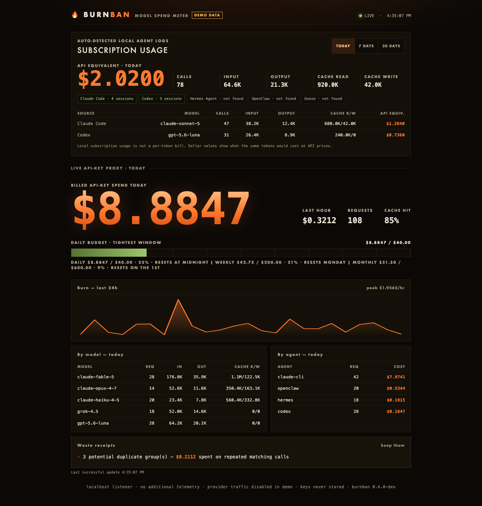

# 🔥 burnban

**Meter, itemize, and cap what your AI agents spend. Meters watch. Burnban acts.**

Your agents run all day on your API keys. Burnban is a single-binary local proxy that sits between them and every provider, shows you the burn in real time, itemizes the waste with dollar amounts attached, and cuts spend off when you say so. No signup, no cloud, no telemetry — your traffic never leaves your machine.



> Two frontier models launched on the same day this week, four-x apart on price. You can't manage what you don't meter.

## Quickstart

No traffic yet? See it alive first — fake data, fresh every run:

```sh
burnban demo    # dashboard on http://localhost:4242
```

Then the real thing:

```sh
# 1. run the meter
burnban serve

# 2. point your agents at it (keys stay in your env — burnban never stores them)
export ANTHROPIC_BASE_URL=http://localhost:4141/anthropic
export OPENAI_BASE_URL=http://localhost:4141/openai/v1

# 3. watch the burn
burnban top                      # in the terminal, or
open http://localhost:4141       # the live dashboard
```

Set a budget and forget about surprise bills:

```sh
burnban cap --daily 10 --weekly 40 --monthly 120   # 402 past any of them
burnban cap --agent openclaw --daily 3             # that one hungry agent gets $3
burnban cap --warn 80                              # webhook ping at 80% of any cap
burnban ban                                        # emergency stop: pause ALL spend now
burnban lift --today                               # resume, overriding today's caps
```

And when the bill makes you wonder:

```sh
burnban whatif --since 7d       # your exact week repriced on every model
```

## What you get

- **Live dashboard** at `http://localhost:4141` — the burn total glowing ember, a fuse-style budget bar, per-model/per-agent tables, and waste receipts. One embedded HTML file served from the binary: no CDNs, no build step, nothing loads from the internet.
- **`burnban top`** — the same live view in your terminal: per-model and per-agent spend, cache hit rate, $/hour rate, and a budget bar that goes red before your bill does.
- **`burnban report`** — spend for any window, plus **waste receipts**: duplicate requests that burned money twice, and cache hit rates that mean you're paying full price for context the provider would re-serve at a 90% discount.
- **`burnban whatif`** — reprice a window's actual traffic onto any model in the table, cache economics included. "Your week on haiku: $9.22 (−82%)" — from your own ledger, not a pricing page.
- **Budget enforcement** — daily, weekly, and monthly dollar caps enforced in the request path with a clear 402 your agent surfaces verbatim, per-agent daily caps, a webhook warning at 80% (yours to tune) *before* the hard stop, and a manual **burn ban** kill switch.
- **Honest numbers** — usage comes from provider usage frames, priced per model including cache read/write economics. Unknown models are recorded as unpriced, never guessed. Estimated counts are flagged as estimates.

## How it works

```
agents (Claude Code, Codex, OpenClaw, Hermes, your app)
   │  one env var change
   ▼
burnban serve  ──►  anthropic / openai / gemini / xai / any --upstream
   │
   ├─ passes every byte through unmodified (SSE included)
   ├─ reads usage frames, prices them (cache-aware)
   ├─ SQLite at ~/.burnban/burnban.db — yours, greppable
   └─ refuses to forward when you're over budget
```

Burnban binds to `127.0.0.1` only. It is a pass-through observer: request and response bodies are never rewritten, and API keys are forwarded, never persisted.

## Why not the big gateway?

The tools in this space either **watch** or **weigh a ton**. Log reporters ([ccusage](https://github.com/ccusage/ccusage), usage monitors) read what your agents already spent and can't stop the next dollar. Platform gateways enforce budgets, but [LiteLLM needs Postgres for budget state and Redis to enforce accurately across workers](https://docs.litellm.ai/docs/proxy/users), issues clients **its own virtual keys** instead of passing yours through, and [benchmarks its proxy overhead in milliseconds on a four-instance cluster](https://docs.litellm.ai/docs/benchmarks). Cloud gateways cap spend fine — through their cloud.

|  | log reporters (ccusage…) | platform gateways (LiteLLM…) | cloud gateways (Cloudflare…) | **burnban** |
|---|---|---|---|---|
| stops overspend in the request path | — | ✅ | ✅ | ✅ **402 + kill switch** |
| runs entirely on your machine | ✅ | ◐ self-hosted service | — | ✅ localhost-only default |
| your provider keys stay yours | ✅ n/a | — virtual keys | — provider keys uploaded | ✅ pass-through, never stored |
| infra needed | none | Postgres + Redis + config | an account | **one binary, one SQLite file** |
| waste receipts (dupes, cache misses) | — | — | — | ✅ |
| reprice your traffic (`whatif`) | — | — | — | ✅ |
| agent self-throttling over MCP | — | — | — | ✅ |

The honest flip side: LiteLLM speaks 100+ providers and does routing, fallbacks, and org-level key issuance — if you're a platform team standing up a company gateway, use it. Burnban is for the other 99%: you, your laptop, your agents, your bill.

### Measure it, don't trust it

```sh
burnban bench
```

stands up an instant loopback upstream and runs the same traffic direct and through a fully armed proxy — metering, pricing, and a live budget check on every request. On an M-series laptop, 2,000 requests × 4 clients:

```
                p50       p90       p99      mean
direct        103µs     174µs     332µs     115µs
burnban       628µs     1.7ms     8.8ms     1.0ms
─────────────────────────────────────────────────
added         525µs     1.5ms     8.5ms     924µs
```

**~0.5ms median, with the durable ledger write and cap check included** — against an instant upstream, the worst case a proxy can face (the p99 tail is SQLite checkpointing; real inference calls run seconds either way). Percentiles are nearest-rank, warts kept. Run it on your own hardware and check.

## Providers

| provider  | point your client at                | env var the SDKs read |
|-----------|-------------------------------------|-----------------------|
| Anthropic | `http://localhost:4141/anthropic`   | `ANTHROPIC_BASE_URL`  |
| OpenAI    | `http://localhost:4141/openai/v1`   | `OPENAI_BASE_URL`     |
| Gemini    | `http://localhost:4141/gemini`      | `GOOGLE_GEMINI_BASE_URL` |
| xAI       | `http://localhost:4141/xai/v1`      | `OPENAI_BASE_URL` (xAI SDKs are OpenAI-compatible) |

**Anything OpenAI-compatible** — Groq, Mistral, DeepSeek, OpenRouter, your local Ollama or vLLM — mounts as an extra route with one flag and gets metered the same way:

```sh
burnban serve --upstream groq=https://api.groq.com/openai --upstream ollama=http://localhost:11434
# then point clients at http://localhost:4141/groq/v1/…, /ollama/v1/…
```

Endpoint speaks a different dialect? Prefix the url with its usage shape — `--upstream corp=anthropic:https://llm.corp.internal` — and burnban meters it with that provider's parser.

Attribution: burnban groups spend by the client's `User-Agent`. For finer tracking, send `x-burnban-agent` / `x-burnban-session` headers (Claude Code: `ANTHROPIC_CUSTOM_HEADERS`).

OpenAI streaming note: send `stream_options: {"include_usage": true}` for exact counts; without it burnban estimates output tokens and flags them as estimates in reports.

## Plug it into your tools (MCP)

Burnban ships an MCP server, so any MCP client — Claude Code, Claude Desktop, Cursor — can query spend and control budgets in natural language:

```sh
claude mcp add burnban -- burnban mcp
```

Then just ask: *"what have my agents burned today?"*, *"set a $150 weekly cap"*, *"burn ban, now"*. Tools exposed: `spend_summary`, `burn_status`, `set_daily_cap` (daily/weekly/monthly windows), `burn_ban`, `lift_burn_ban`. Everything runs over stdio against the local database — no network, no keys.

`burn_status` reports spent/cap/**remaining** per window, which turns budgets into something agents can plan around: an agent that can ask *"how much runway is left?"* can downshift models or stop gracefully instead of slamming into the 402.

## For IT managers

One binary, one SQLite file, nothing leaves your network. Three deployment shapes:

1. **Per developer** (default) — localhost-only, zero config, each dev owns their meter.
2. **Team gateway** — one instance the whole team points at:

   ```sh
   BURNBAN_TOKEN=$(openssl rand -hex 16) burnban serve --host 0.0.0.0
   ```

   Non-loopback binds **fail closed** without a token. Clients authenticate with the `x-burnban-token` header or `Bearer` auth (Claude Code: `ANTHROPIC_CUSTOM_HEADERS="x-burnban-token: ..."`); the dashboard accepts `?token=`. Spend is attributed per agent and per `x-burnban-session`.
3. **Docker** — `docker build -t burnban . && docker run -e BURNBAN_TOKEN=... -p 4141:4141 -v burnban-data:/data burnban`

And the plumbing your existing stack expects:

- **Prometheus** — scrape `/metrics`: total/per-model/per-agent spend counters, spend and cap gauges for the day/week/month windows, and ban state. Grafana dashboard in two minutes, no exporter.
- **Alerts** — `burnban alert --webhook https://hooks.slack.com/...` posts to Slack (or anything webhook-compatible) at 80% of any cap (tune with `cap --warn`) and again when a cap trips.
- **Finance export** — `burnban export --since 7d --format csv` dumps the raw ledger for cost allocation; `--format json` for pipelines.
- **Audit trail** — every request row (timestamp, model, agent, session, tokens, cost, status) lives in plain SQLite you can query directly.

## Pricing table

Current prices for the July 2026 lineup (Claude Fable 5 / Opus 4.8 / Sonnet 4.6 / Haiku 4.5, GPT-5.6 Sol/Terra/Luna, Gemini 3 Pro/Flash and 2.5, Grok 4.5) ship embedded. Vendors change prices; override or extend without waiting for a release by creating `~/.burnban/pricing.json`:

```json
{"models": {"grok-4.5": {"input_per_mtok": 2.0, "output_per_mtok": 6.0, "cache_read_mult": 0.1}}}
```

## Roadmap

- **Cache-aware request shaping** — stabilize prompt prefixes to turn cache misses into 90%-off hits
- **Downshift routing** — send trivial calls to a cheap tier or your local Ollama, by policy (`whatif` already tells you what it would save)
- **`burnban doctor`** — one command that verifies your agents are actually flowing through the meter
- **State of Agent Spend** — opt-in anonymous aggregates, published monthly

## Development

```sh
make build   # single static binary, no cgo
make test    # offline: fixtures, not API calls — development burns $0
```

MIT © Oday Brahem
